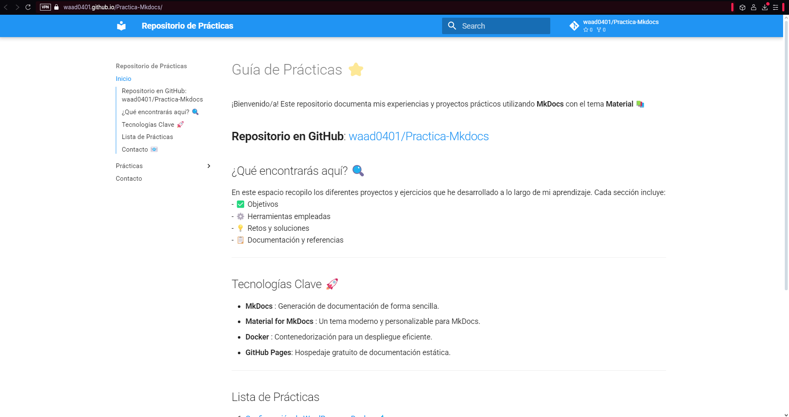

# Practica-Mkdocs
Primero debemos crear un nuevo proyecto, para ello empleamos el siguiente comando.
  

Con esto creamos modifcamos el index para modificar nuestra pagina y tener nuestros repositorios. Desppues de la modificacion lazanmos el siguiente comando, para ver el contenido de nuestra pagina a nivel local.  


Ahora entraremos a la parte de que se pueda acceder a el pero ya no solo en local.  
Este comando nos generara el dictorios sites.


Y ahora para publicarlo en github pages se emplea el siguiente comando. 


Ahora debemos modificar los workflows y crear uno nosotros que para que publique de manera automatica el mkdocsc, este tiene que tener el siguiente codigo
```yaml
name: build-push-mkdocs

# Eventos que desescandenan el workflow
on:
  push:
    branches: ["main"]

  workflow_dispatch:

# A workflow run is made up of one or more jobs that can run sequentially or in parallel
jobs:

  # Job para crear la documentación de mkdocs
  build:
    # Indicamos que este job se ejecutará en una máquina virtual con la última versión de ubuntu
    runs-on: ubuntu-latest
    
    # Definimos los pasos de este job
    steps:
      - name: Clone repository
        uses: actions/checkout@v4

      - name: Install Python3
        uses: actions/setup-python@v4
        with:
          python-version: 3.x

      - name: Install Mkdocs
        run: |
          pip install mkdocs
          pip install mkdocs-material 

      - name: Build MkDocs
        run: |
          mkdocs build

      - name: Push the documentation in a branch
        uses: s0/git-publish-subdir-action@develop
        env:
          REPO: self
          BRANCH: gh-pages # The branch name where you want to push the assets
          FOLDER: site # The directory where your assets are generated
          GITHUB_TOKEN: ${{ secrets.GITHUB_TOKEN }} # GitHub will automatically add this - you don't need to bother getting a token
          MESSAGE: "Build: ({sha}) {msg}" # The commit message
```

### Comprobacion
Comproaciones de los workflows
  
  

Pagina principal
  
