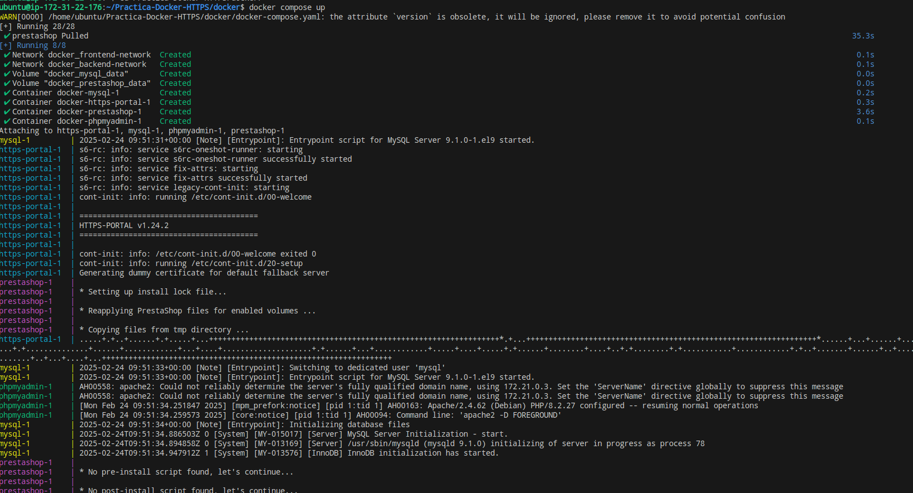
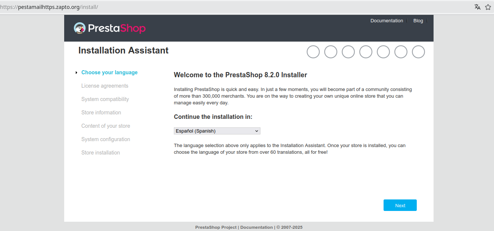
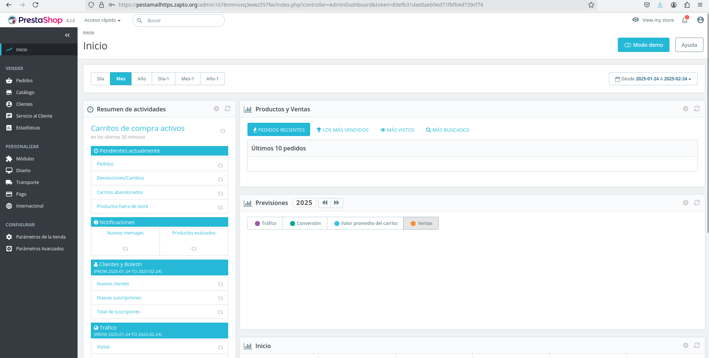
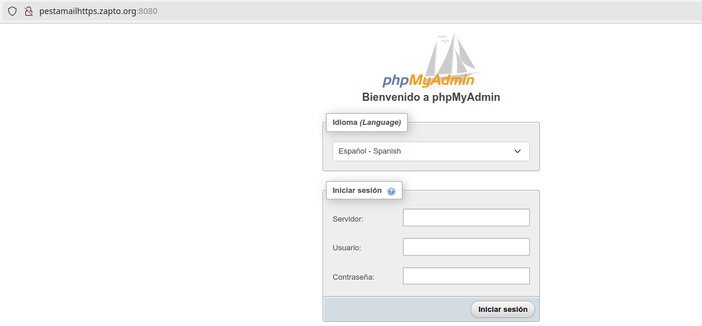
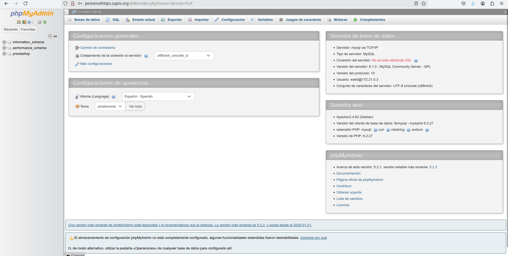

# Practica-Docker-HTTPS
En esta practica vamos a utilizar docker y docker compose para habilitar un protocolo https en prestashop y se ejecutara sobre los contenedores de docker.
Para ello primero tendremos que tener una maquina con minimo 20 de espacio

Para poder continuar y lanzar el script, se nos requiere que tengamos docker y docker compose instalados en la maquina
```
apt install -y docker-ce docker-ce-cli containerd.io docker-compose-plugin
```
Con eso instalado ya podremos lanzar el script donde crearemos 3 contenedores, uno de mysql , el de Wordpress, y donde estara el certificado lets encrypt que actuara de proxy inverso para redirigir el trafico al contenedor de Prestashop

## Comprobaciones
Comprobacion de que los contenedores se han creado correctamente.


Ahora accedemos al la pagina de prestashop.

Como podemos ver tenemos el Prestashop installer, lo procederemos a instalar , teniendo en cuenta que tenemos que activar los parametros de SSL, y poniendo bien las variables de referencia a la base de datos.  
Una vez que se nos decarge se nos quedara la siguiente pagina:


Ahora intentamos acceder la pagina de phpmyadmin, y tendremos el menu de inicio.


Una vez que rellenamos los campos ya estaremos dentro del phpmyadmin y modemos ver las bases de datos del contenedor.

