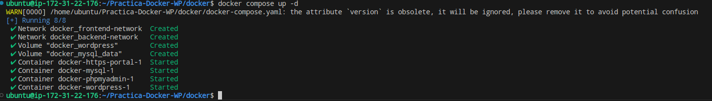
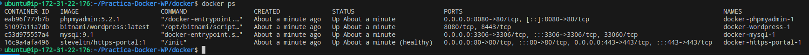
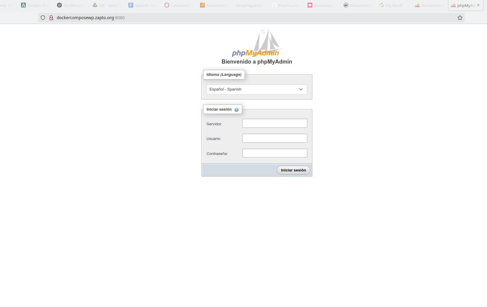
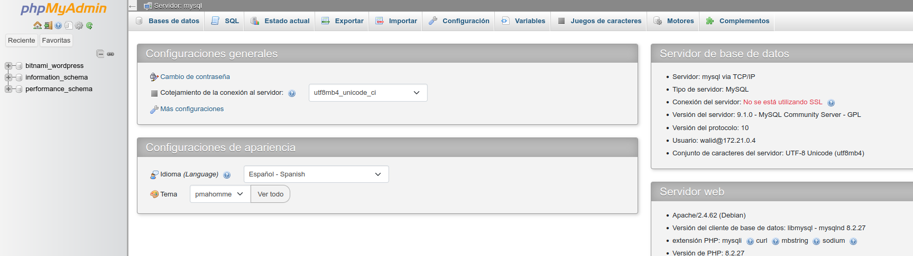
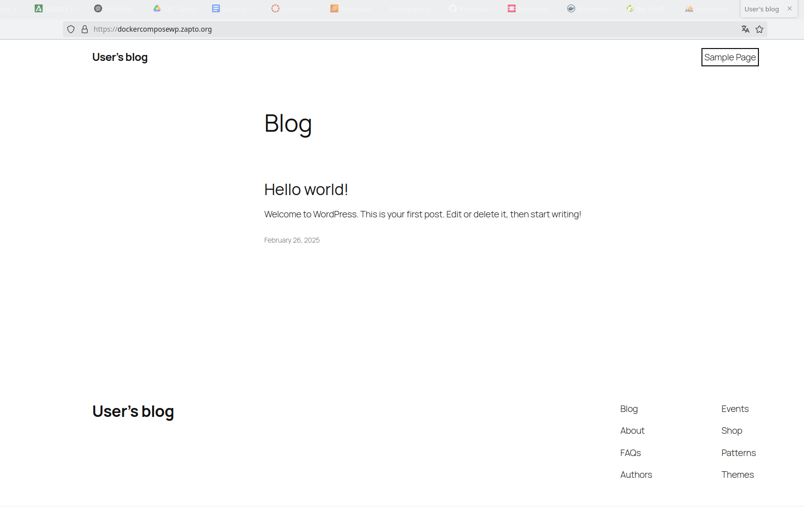

# Practica-Docker-WP
En esta practica vamos a utilizar docker y docker compose para habilitar un protocolo https en prestashop y se ejecutara sobre los contenedores de docker.
Para ello primero tendremos que tener una maquina con minimo 20 de espacio

Para poder continuar y lanzar el script, se nos requiere que tengamos docker y docker compose instalados en la maquina
```
apt install -y docker-ce docker-ce-cli containerd.io docker-compose-plugin
```
Con eso instalado ya podremos lanzar el script donde crearemos 3 contenedores, uno de mysql , el de Wordpress, y donde estara el certificado lets encrypt que actuara de proxy inverso para redirigir el trafico al contenedor de Wordpress

## Comprobaciones
Comprobacion de que los contenedores se han creado correctamente.


Comprobacion que los contenedores estan activos y ejecutandose.


Una vez que accedemos configuramos para comprobar que la base de datos funciona correctamente, conectandonos al phpmyadmin.  
Menu de inicio:  


Base de datos:  


Ahora comprobaremos que el wordpress funciona correctamente.  

